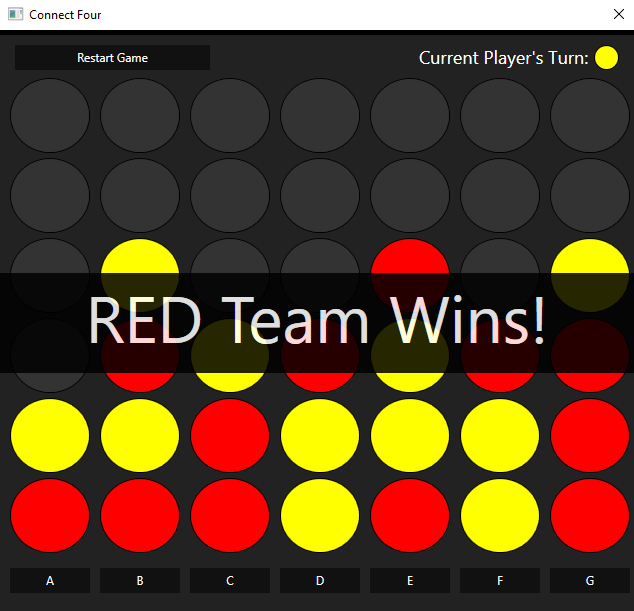
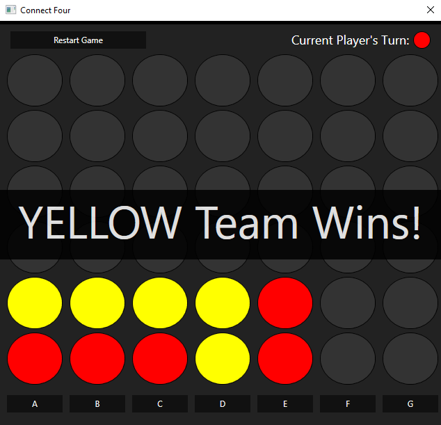

# connect-four
A game of Connect Four as a WPF application to showcase C# programming skills.
  
## Content
 - [How To Run?](#How-To-Run?)
   - [Requirements](#Requirements)
   - [Development Tools](#Development-Tools)
 - [Showcase Screenshots](#Showcase-Screenshots)
 - [Design](#Design)
   - [UI](#UI)
   - [Logic](#Logic)
  
## How to Run
A sample `connect-four.exe` file can be found in the `exe` directory.
  
**Note:** if you wish to compile your own .exe file then please use the [Development Tools](#Development-Tools)
  
### Requirements
Any of the following:
 * Windows 7 SP1+
 * Windows 8.1
 * Windows 10
  
### Development Tools
 * Visual Studio 2019
 * .NET Core 3.0
  
## Showcase Screenshots
  
**Mid-Game**

  
**Red-Wins**

  
**Yellow Wins**

  
## Design
Deisgned to be a portable version for a game of Connect Four.
  
### UI
A game of connect four has seven columns and six rows. So I just needed a few extra UI elements:
 * A reset button
 * A status bar to display the current players turn
 * Each column will need a button (rows do not as each coin sits on top of the previous)
 * Stackpanels to house the columns and buttons (makes the UI far more manageable)
  
**UI Design:**  

  
### Logic
Originally the logic design was to check the entire grid for a win condition.  
An optimised solution was found by checking the, diaginal, horizontal, and vertical, axes from the players most recent move.  
  
**Optimised Logic Design:**  

